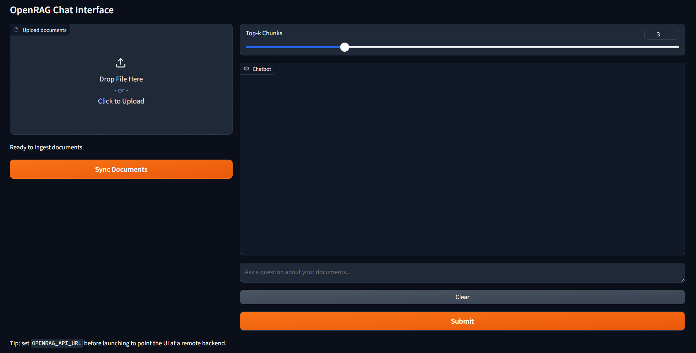

# OpenRAG


OpenRAG is a reference implementation of a retrieval augmented generation (RAG) stack built around
FastAPI, LangChain, Chroma, and optional Qwen/Transformers models. The project is structured to showcase modular ingestion,
embedding, retrieval, and generation layers with a Gradio-based user experience.

## Screenshot



## Getting Started

The project uses [uv](https://github.com/astral-sh/uv) for dependency management but remains compatible
with any PEP 517 compliant toolchain.

```bash
# Create and populate a virtual environment (with uv)
uv sync

# Run tests and type checks
uv run pytest
uv run mypy src tests
uv run ruff check .
```

If you prefer `pip`, install the dependencies from `pyproject.toml` and run the same commands within
an activated virtual environment.

Copy `.env.example` to `.env` and adjust values as needed to configure Chroma, embeddings, upload size limits, and CORS.

Security: set `OPENRAG_API_KEY` to require `X-API-Key` on protected endpoints. Tune rate limits via `OPENRAG_RATE_LIMIT_REQUESTS` and `OPENRAG_RATE_LIMIT_WINDOW_SECONDS`.

## Repository Layout

```
.
|- Dockerfile
|- Dockerfile.ui
|- Makefile
|- docker-compose.yml
|- pyproject.toml
`- src/
    `- openrag/
        |- __init__.py
        |- api/
        |   |- app.py
        |   `- schemas.py
        |- embeddings/
        |   |- __init__.py
        |   |- service.py
        |   `- store.py
        |- eval/
        |   |- __init__.py
        |   |- __main__.py
        |   `- cli.py
        |- ingestion/
        |   |- __init__.py
        |   `- service.py
        |- metrics/
        |   |- __init__.py
        |   `- observability.py
        |- retrieval/
        |   |- __init__.py
        |   `- service.py
        |- services/
        |   |- __init__.py
        |   |- generation.py
        |   `- query.py
        |- ui/
        |   |- __init__.py
        |   `- app.py
        |- utils/
        |   `- __init__.py
        |- config.py
        `- models.py
```

- `Dockerfile` / `Dockerfile.ui` – container images for the FastAPI API and Gradio UI.
- `Makefile` – helper targets for composing the stack.
- `docker-compose.yml` – local stack orchestrating Chroma, the API, and the UI.
- `src/openrag/api` – FastAPI app and pydantic schemas.
- `src/openrag/ingestion` – LangChain-powered document ingestion services.
- `src/openrag/embeddings` – deterministic hash embeddings, optional model embeddings (default BGE small), and Chroma store.
- `src/openrag/retrieval` – retriever contracts and Chroma-backed implementation.
- `src/openrag/services` – orchestration for generation and query flow.
- `src/openrag/metrics` – Prometheus histograms and structured logging helpers.
- `src/openrag/ui` – Gradio chat interface and API client.
- `src/openrag/eval` – CLI harness for recall and MRR evaluation.
- `src/openrag/config.py` / `models.py` – shared configuration and domain models used throughout the pipeline.

The initial bootstrap focuses on establishing a deterministic environment, strict typing, and smoke
tests so that subsequent tasks can build on a solid foundation.

## Developer Workflow

1. Activate your environment (`uv shell` or your preferred virtualenv) and install dependencies (`uv sync`).
2. Create a `tests/` directory (the repository does not ship tests yet) and add coverage alongside new changes.
3. Run `uv run pytest` to execute the test suite once tests exist.
4. Use `uv run mypy src tests` to enforce type safety.
5. Format and lint with `uv run ruff check .` (and `uv run ruff format .` if needed).

## Continuous Integration

The CI workflow (`.github/workflows/ci.yml`) mirrors the local developer commands:

- `uv run ruff check .`
- `uv run pytest --cov=src --cov-report=xml`
- `uv run mypy src tests`

Artifacts contain coverage reports per Python version. A simple compose smoke script is included (`scripts/compose_smoke.py`).

## Ingestion Pipeline

`openrag.ingestion.LangChainDocumentIngestor` supports PDF, DOCX, and TXT sources using LangChain
loaders with `RecursiveCharacterTextSplitter`. Update `IngestionConfig` to tune `chunk_size`,
`chunk_overlap`, or text encoding when ingesting local corpora.

## Embeddings & Vector Store

`openrag.embeddings.QwenEmbeddingBackend` wraps LangChain's HuggingFace embeddings so that model
embeddings can be enabled by setting `use_model=True`. By default, a deterministic hash backend keeps
tests fast and offline friendly. `ChromaEmbeddingStore` manages persistence and similarity search,
defaulting to an in-memory client unless a `persist_directory` is provided.

## Retrieval & Generation

`QueryService` composes a `ChromaRetriever` with a generation backend. The default pairing uses a
lightweight template generator for deterministic tests, while `QwenGenerator` can be enabled when
Qwen weights are available. Prompts embed citation markers so UI layers can render attribution.

## API Usage

Launch the FastAPI app with `uvicorn openrag.api.app:app --reload`. The OpenAPI schema documents the
`POST /documents` and `POST /query` endpoints.

- `/documents`: upload PDF/DOCX/TXT/MD files (multipart) to ingest and index them. Uploads are streamed to disk with configurable file/type/size limits.
- `/query`: submit a JSON payload `{"question": "...", "top_k": 3}` to receive an answer + citations.
- `/index` (DELETE): reset the vector index (optionally pass `?dataset_id=...`).
- `/healthz`, `/healthz/ready`: basic and readiness endpoints.

Extras:

- Streaming: `/query/stream` streams `text/event-stream` chunks (`data: ...`).
- Remote ingestion: `/documents/url` downloads and ingests URLs (restricted by domain and size).
- Dataset scoping: include `dataset_id` with uploads (form) and queries (JSON) to isolate corpora; defaults to `OPENRAG_DEFAULT_DATASET` or `default`.
- Dataset stats: `/index/stats` returns per-dataset chunk counts and total.
 - Admin UI: the Gradio app includes controls to refresh index stats and reset a dataset.

Optional reranking:

- Enable lexical rerank via `OPENRAG_RETRIEVAL_RERANK_LEXICAL=true`.
- For cross‑encoder reranking (requires extra install), set `OPENRAG_CROSS_ENCODER_USE=true` and choose a model such as `cross-encoder/ms-marco-MiniLM-L-6-v2`. Install extra:

  pip install .[rerank]
  docker images build from the provided Dockerfile already include `[rerank]` extras.

Run integration coverage with:

```bash
uv run pytest -m integration
```

Set `OPENRAG_QWEN_SMOKE=1` to enable the optional Qwen smoke test (downloads model weights).

## Gradio UI

Launch the UI with:

```bash
uv run python -m openrag.ui.app
```

Set `OPENRAG_API_URL` to point the frontend at a remote backend. Upload PDF/DOCX/TXT files and ask
questions; the chat view inlines citation links for each response.

## Docker Compose

```bash
make compose-up
# After containers are running
make compose-smoke
make compose-down
```

The compose stack starts the API, Gradio UI, and a dedicated Chroma service. `OPENRAG_API_URL`
controls the URL the UI targets, while `OPENRAG_CHROMA_HOST/PORT/SSL` configure remote Chroma
connections for the API container. `make compose-smoke` runs a basic readiness probe.

## Observability

- Service logs use `structlog` with correlation IDs propagated from `X-Request-ID` headers.
- Prometheus metrics are exposed at `GET /metrics` and include ingestion, retrieval, generation, and
  grounding score histograms.

## Evaluation

Run the retrieval accuracy harness with the bundled fixture or your own dataset:

```bash
uv run python -m openrag.eval --dataset evaluations/fixtures/sample.json --top-k 3 --json-out report.json
```

Use `--min-recall`/`--min-mrr` to adjust thresholds. The command exits non-zero when metrics fall
tbelow configured thresholds (`OPENRAG_EVALUATION_MIN_RECALL`, `OPENRAG_EVALUATION_MIN_MRR`).
